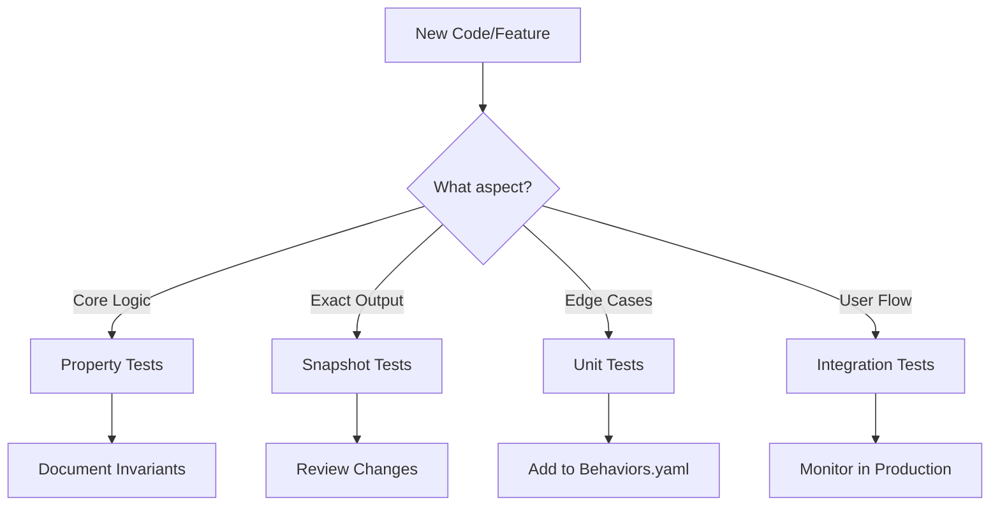

# Unified Testing and Behavioral Preservation Strategy

**Created**: 2025-01-06 22:00:00  
**Purpose**: Combine modern testing practices with behavioral preservation techniques into a single, actionable strategy  
**Context**: Addresses overlap between MODERN_TESTING_STRATEGY.md and BEHAVIORAL_PRESERVATION_RESEARCH.md

## Executive Summary

This document unifies two critical aspects of software quality:
1. **Building confidence through testing** (what to test and how)
2. **Preserving behavior during changes** (especially with AI assistance)

**Core Philosophy**: Use behavioral tests as both quality indicators and regression guards. The same tests that give you confidence to ship also protect against unintended changes.

## The Unified Approach

### Three Pillars of Quality

```
1. FOUNDATION LAYER (Build Confidence)
   ├── Property-based tests (invariants)
   ├── Unit tests (critical paths)
   └── Integration tests (user flows)

2. PRESERVATION LAYER (Detect Changes)
   ├── Snapshot tests (exact behavior)
   ├── Mutation testing (test quality)
   └── Behavioral documentation

3. FEEDBACK LAYER (Learn & Adapt)
   ├── Production monitoring
   ├── Test impact analysis
   └── Organic test growth
```

## Implementation Strategy

### Phase 1: Establish Testing Foundation (Week 1-2)

#### 1.1 Add Core Dependencies
```toml
[dev-dependencies]
# Foundation
proptest = "1.4"                                    # Property-based testing
rstest = "0.18"                                    # Parameterized tests

# Preservation  
insta = { version = "1.34", features = ["yaml", "redactions"] }  # Snapshots
cargo-mutants = "23.12"                            # Mutation testing

# Performance
criterion = { version = "0.5", features = ["html_reports"] }     # Benchmarks
```

#### 1.2 Define Behavioral Invariants
```rust
// Core properties that must ALWAYS hold
proptest! {
    #[test]
    fn duration_is_positive(
        distance in 0.1..300.0,
        elevation in 0.0..3000.0
    ) {
        let duration = estimate_duration(distance, elevation);
        prop_assert!(duration > 0.0, "Duration must be positive");
    }

    #[test]
    fn longer_routes_take_more_time(
        base_distance in 10.0..100.0,
        extra in 1.0..50.0,
        elevation in 0.0..1000.0
    ) {
        let short = estimate_duration(base_distance, elevation);
        let long = estimate_duration(base_distance + extra, elevation);
        prop_assert!(long > short, "Monotonic with distance");
    }
}
```

#### 1.3 Create Baseline Snapshots
```rust
#[test]
fn snapshot_core_behaviors() {
    // Snapshot known good outputs
    let test_cases = vec![
        ("flat_route", 25.0, 50.0),
        ("hilly_route", 25.0, 500.0),
        ("mountain_route", 12.0, 1000.0),
    ];
    
    for (name, distance, elevation) in test_cases {
        let result = estimate_duration(distance, elevation);
        insta::assert_yaml_snapshot!(
            format!("{}_estimation", name),
            result
        );
    }
}
```

### Phase 2: Behavioral Preservation Setup (Week 2-3)

#### 2.1 Create Behavioral Documentation
```yaml
# behaviors.yaml - Single source of truth for expected behaviors
core_behaviors:
  duration_estimation:
    invariants:
      - id: positive_duration
        description: "Duration is always positive"
        priority: critical
        tested_by: ["property_tests::duration_is_positive"]
      
      - id: distance_monotonic
        description: "Longer distance means longer duration"
        priority: high
        tested_by: ["property_tests::longer_routes_take_more_time"]
    
    edge_cases:
      - id: minimum_duration
        description: "Never less than 5 minutes"
        value: 5.0
        tested_by: ["unit_tests::test_minimum_duration"]

  event_filtering:
    invariants:
      - id: no_expired_events
        description: "Never return events in the past"
        priority: critical
        tested_by: ["integration_tests::test_expired_filtering"]
```

#### 2.2 Establish Change Detection Workflow
```rust
// src/lib.rs - Add behavioral contracts to functions
/// Estimates race duration based on route characteristics.
/// 
/// # Behavioral Contract
/// - Returns value between 5.0 and 180.0 minutes
/// - Monotonic with distance (more distance = more time)
/// - Increases with elevation (more climbing = more time)
/// - Within 20% of historical averages for known routes
#[behavioral_contract]
pub fn estimate_duration(distance_km: f64, elevation_m: f64) -> f64 {
    debug_assert!(distance_km > 0.0, "Distance must be positive");
    debug_assert!(elevation_m >= 0.0, "Elevation cannot be negative");
    
    let estimate = calculate_base_time(distance_km)
        * get_elevation_factor(elevation_m);
    
    estimate.clamp(5.0, 180.0)
}
```

#### 2.3 Run Mutation Testing Baseline
```bash
# Establish mutation testing baseline
cargo mutants --file src/main.rs --output baseline.json

# Create mutation survival tracking
echo "# Mutation Testing Baseline - $(date)" > MUTATION_BASELINE.md
echo "Total Mutants: $(jq '.total_mutants' baseline.json)" >> MUTATION_BASELINE.md
echo "Killed: $(jq '.killed' baseline.json)" >> MUTATION_BASELINE.md
echo "Survived: $(jq '.survived' baseline.json)" >> MUTATION_BASELINE.md
echo "Timeout: $(jq '.timeout' baseline.json)" >> MUTATION_BASELINE.md
```

### Phase 3: AI-Safe Development Workflow (Week 3-4)

#### 3.1 Pre-Change Checklist
```bash
#!/bin/bash
# pre-change-checklist.sh

echo "=== Pre-Change Safety Checklist ==="

# 1. Snapshot current behavior
echo "1. Creating behavior snapshots..."
cargo test --test snapshots -- --ignored

# 2. Run property tests
echo "2. Verifying invariants..."
cargo test --test properties

# 3. Check mutation score
echo "3. Checking test strength..."
cargo mutants --file src/main.rs --timeout 300

# 4. Document current performance
echo "4. Recording performance baseline..."
cargo bench --bench performance -- --save-baseline before_change

echo "=== Ready for changes. Baseline established. ==="
```

#### 3.2 During Changes (AI or Human)
```rust
// Use this template when working with AI
/*
AI MODIFICATION CONSTRAINTS:
1. Preserve all behavioral contracts documented above
2. Maintain snapshot test compatibility (or explicitly update)
3. Keep property test invariants passing
4. Performance should not degrade >10%

CURRENT BEHAVIOR:
- estimate_duration(25.0, 100.0) returns ~35.5 minutes
- Elevation factor is 1.0002 per meter
- Minimum duration is 5.0 minutes

DO NOT CHANGE:
- Core estimation algorithm logic
- Public API signatures
- Error handling behavior
*/
```

#### 3.3 Post-Change Validation
```bash
#!/bin/bash
# post-change-validation.sh

echo "=== Post-Change Validation ==="

# 1. Check behavioral changes
echo "1. Checking for behavioral changes..."
cargo test --test snapshots
if [ $? -ne 0 ]; then
    echo "⚠️  Snapshot changes detected. Review with: cargo insta review"
fi

# 2. Verify invariants still hold
echo "2. Verifying invariants..."
cargo test --test properties -- --nocapture

# 3. Compare mutation scores
echo "3. Comparing test strength..."
cargo mutants --file src/main.rs --timeout 300 --output after.json
python3 compare_mutation_scores.py baseline.json after.json

# 4. Check performance
echo "4. Comparing performance..."
cargo bench --bench performance -- --baseline before_change

echo "=== Validation complete. Check results above. ==="
```

### Phase 4: Continuous Improvement (Ongoing)

#### 4.1 Test Quality Metrics
```python
# test_quality_metrics.py
import json
import yaml
from datetime import datetime

def calculate_test_quality_score():
    """Combine multiple metrics for overall test quality"""
    
    # Load metrics
    with open('behaviors.yaml') as f:
        behaviors = yaml.safe_load(f)
    
    with open('mutation_results.json') as f:
        mutations = json.load(f)
    
    # Calculate scores
    behavioral_coverage = sum(1 for b in behaviors['core_behaviors'].values() 
                            for i in b['invariants'] 
                            if i.get('tested_by'))
    
    mutation_score = mutations['killed'] / mutations['total_mutants']
    
    # Weight the scores
    quality_score = (
        behavioral_coverage * 0.4 +  # 40% behavioral coverage
        mutation_score * 0.4 +       # 40% mutation score
        0.2                          # 20% for having the process
    )
    
    return {
        'timestamp': datetime.now().isoformat(),
        'behavioral_coverage': behavioral_coverage,
        'mutation_score': mutation_score,
        'quality_score': quality_score,
        'confidence_level': 'HIGH' if quality_score > 0.8 else 'MEDIUM'
    }
```

#### 4.2 Production Feedback Loop
```rust
// Add to production code
use serde_json::json;

pub fn estimate_duration_with_telemetry(
    route: &Route,
    category: Category,
) -> Duration {
    let start = Instant::now();
    let estimate = estimate_duration(route.distance_km, route.elevation_m);
    
    // Log for production analysis
    if let Ok(json) = json!({
        "event": "duration_estimation",
        "route_id": route.id,
        "distance_km": route.distance_km,
        "elevation_m": route.elevation_m,
        "category": category,
        "estimated_minutes": estimate.as_minutes(),
        "computation_time_us": start.elapsed().as_micros(),
        "version": env!("CARGO_PKG_VERSION"),
    }).to_string() {
        log::info!("{}", json);
    }
    
    estimate
}

// Weekly analysis query
```sql
WITH estimates AS (
    SELECT 
        route_id,
        AVG(estimated_minutes) as avg_estimate,
        STDDEV(estimated_minutes) as std_dev,
        COUNT(*) as sample_size
    FROM production_logs
    WHERE event = 'duration_estimation'
        AND timestamp > NOW() - INTERVAL '7 days'
    GROUP BY route_id
)
SELECT 
    r.name,
    e.avg_estimate,
    e.std_dev,
    e.sample_size,
    CASE 
        WHEN e.std_dev / e.avg_estimate > 0.2 THEN 'HIGH_VARIANCE'
        ELSE 'STABLE'
    END as stability
FROM estimates e
JOIN routes r ON e.route_id = r.id
ORDER BY e.sample_size DESC;
```

## Decision Framework

### When to Write Which Test



### When to Update Tests vs Preserve Behavior

| Scenario | Action | Validation |
|----------|--------|------------|
| Bug fix | Update tests to expect correct behavior | Ensure fix doesn't break other behaviors |
| Refactoring | Tests must pass unchanged | Run mutation testing before/after |
| New feature | Add new tests, preserve existing | Check for unintended side effects |
| Performance optimization | Behavior unchanged, performance improved | Benchmark before/after |
| AI-assisted change | Extra snapshot coverage | Manual review of all changes |

## Tool Selection Matrix

### Essential Tools (Install These First)

| Purpose | Tool | Why | Setup Time |
|---------|------|-----|------------|
| Property Testing | proptest | Finds edge cases automatically | 30 min |
| Snapshot Testing | insta | Detects any behavioral change | 20 min |
| Mutation Testing | cargo-mutants | Validates test quality | 45 min |
| Benchmarking | criterion | Tracks performance changes | 20 min |

### Advanced Tools (Add As Needed)

| Purpose | Tool | When to Add |
|---------|------|-------------|
| Test Runner | cargo-nextest | When test suite > 50 tests |
| Coverage Analysis | cargo-llvm-cov | For coverage reports |
| Contract Testing | contracts crate | For formal specifications |
| Fuzzing | cargo-fuzz | For security-critical parsing |

## Anti-Patterns to Avoid

### In Testing
1. **Coverage Theater**: Writing tests just for numbers
2. **Brittle Snapshots**: Including timestamps, IDs, or other non-deterministic data
3. **Property Test Overuse**: Using properties for simple unit test cases
4. **Mutation Testing Obsession**: Trying to kill every mutant

### In Preservation
1. **Change Paralysis**: Being afraid to modify code
2. **Snapshot Proliferation**: Snapshotting everything
3. **Over-Documentation**: Documenting obvious behaviors
4. **Process Over Pragmatism**: Following process when it doesn't add value

## Quick Start Commands

```bash
# Initial setup (one time)
cargo add --dev proptest insta rstest criterion
cargo install cargo-mutants cargo-nextest cargo-llvm-cov

# Before making changes
./pre-change-checklist.sh

# After making changes  
./post-change-validation.sh

# Weekly quality check
cargo mutants
cargo llvm-cov --html
python3 test_quality_metrics.py
```

## Success Metrics

### Quantitative
- **Mutation Score**: >75% (not 100% - some mutants aren't worth killing)
- **Behavioral Coverage**: >85% of user-facing behaviors
- **Snapshot Stability**: <5% snapshot changes per month
- **Test Speed**: <30 seconds for full suite

### Qualitative
- Confidence to deploy on Friday afternoon
- New developers understand the test suite
- AI modifications rarely break tests
- Refactoring feels safe

## Specific Recommendations for Zwift Race Finder

### Immediate Actions (This Week)
1. Add property tests for duration estimation monotonicity
2. Snapshot test 10 known race calculations
3. Run mutation testing on main.rs
4. Document core behavioral invariants

### Next Month
1. Add production telemetry for estimate accuracy
2. Create regression test suite from production data
3. Implement test impact analysis
4. Set up behavioral coverage tracking

### Long Term
1. Build confidence through organic test growth
2. Use production data to refine estimates
3. Maintain <20% prediction error through testing

## Conclusion

This unified strategy combines the best of both approaches:
- **Modern testing practices** build confidence through quality tests
- **Behavioral preservation** protects against regressions
- **Production feedback** ensures tests reflect reality

The key insight: The same tests that make you confident to ship also protect against unintended changes. By focusing on behavioral testing, property-based testing, and snapshot testing, we achieve both goals with one cohesive strategy.

Remember: **Tests are a tool for confidence, not compliance. Build the test suite that lets you ship with confidence, then use it to preserve the behaviors your users depend on.**